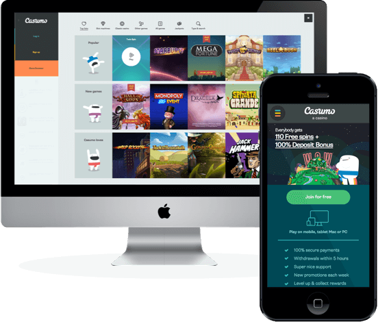

## From idea to Casumo.com
{: .customer-case}
It all started out with a group of tech guys who worked at
an online casino and who saw huge potential in developing
a technologically unique casino system. They had fun together
and were motivated to learn and implement the newest
technological concepts to build an advanced system which
would power the big online casino games in the Nordic
countries following with UK and other countries as well.
An important source of their inspiration was Greg Young and
his talks on CQRS and Event Sourcing. That convinced them
that CQRS-based architecture was the best way to develop
the new casino platform. The goal of the team was not just
to build a scalable casino platform but to build a scalable
development team as well.

>“To be more confident when developing a system
 based on CQRS we chose Axon Framework
 because it was the most complete framework
 which enabled the CQRS implementations.”

After spending some time researching the implementation
and benefits of CQRS, they finally settled on architecture
based on CQRS and Microservices. The architecture’s loosely
coupled components were particularly appealing to the team,
as the system could then be divided into smaller sections
and distributed to smaller teams. The teams worked in parallel
without the need to oversee the whole system, resulting in
faster development of the small, isolated software components.
The Casumo team had the guts to choose some not yet very
commonly used CQRS principles and, after some research, they
discovered that Axon is the only complete framework that
enables CQRS implementation. Building their own framework
was not an option, as that would take time and distract them
from their main business focus. They decided to use Axon
Framework, thereby moving the project from paper to reality.
In addition to the architecture requirements and distribution
of work to small, scalable teams, the modern agile development
method was a fixed prerequisite. CQRS does not itself provide
an agility aspect, but it forces the development mindset to
simplify loosely coupling dierent systems.

## Challenges: Keep the spin button FAST
When doing something new in a relatively young, highly
competitive industry, distinguishing yourself is important.
The right technology is essential to achieving that. The team’s
motto is “Keep that spin button fast” – slot machines require
instant feedback, as every millisecond of delay translates to lost
revenue.
The project development requirements:
- High performance in a high-transaction environment;
- Complex requirements such as CQRS-based design,
highly efficient system design, scalable development
teams, scalable deployment, etc.;
- Agile development method;
- Short time to market, develop the system as quickly
and as stable as possible.

At the system’s core is the online wallet that keeps track of
all casino transactions. It generates a large amount of data,
which requires good, scalable storage. A lot of thought went
into the infrastructure design to optimally support data
creation, storage, and backup. The system design needed to
be scalable for a huge number of transactions and store
billions of events generated by online wallet. An adverse side
effect of the large amount of data is that it becomes nearly
impossible to search.

> “That service should have its own query model.…“

Although a lot of attention went into the wallet’s design,
it eventually required refactoring for improved cohesion
and performance. During the wallet redesign process,
Percona database was introduced as an event store, aiding
the optimization of the MySQL storage tremendously.
The event store design also underwent a shift during
the development process. At the start of the project,
a common event store was used for all the aggregates,
and sharing took place at the application level. Moving
forward with the Microservices architecture, each service
receives its own event store database. Most of them still
reside on the same server, but they can easily be relocated
for load handling if necessary.

## Other parts of the system

The team experimented with many different technologies
and solutions, focusing on keeping things simple wherever
possible.
For example:
- Two different flavors of distributed caches, Hazelcast and
Terracotta, were used for load handling. After some experimentation,
Hazelcast was chosen and is still in use for
some of the services. The use of local Guava caches is
currently preferred, as they make removal of any cross
service dependencies easier. As they only need an event
handle that builds the cache for you, they are also very
easy to populate in an event-sourced system.
- As the Event store was the continuous focus, the team
also tried various NoSQL databases. Percona and its
support were the most comfortable and are used now.

## Solution using Axon Framework

Casumo’s design was based on the business needs,
meaning that everyone in the business is able to understand
what every event means; the platform is modeled according
to the business language.
In this design, CQRS definitely helped steer the project to
the right design and Axon helped with modeling and
solving common, nonfunctional problems. CQRS and event
sourcing forced the construction of an understandable,
scalable, and maintainable system.
Casumo.com mainly uses Polyglot Microservices architecture
with Axon features for the command bus, event sourcing,
and Sagas (the building blocks of CQRS). The framework
was used pragmatically where needed and provided good
input throughout the project, particularly for the infrastructure
and data processing issues.
Experimenting with new things required expert knowledge.
The modeling and ironing out of performance issues
benefited greatly from the expert consultation. The Casumo
development team worked closely together with the
Axon team for modeling and performance issues, and with
the Percona* team for leveraging MySQL for the event
stores as much as possible.

## In summary

*Microservices* were used to help establish the scalable teams
by mapping the problems to smaller chunks which could then
be independently maintained by the teams. Finding the
correct boundaries took some trial-and-error, with larger services
eventually being split up and some smaller services merged
during the development process.

*Event sourcing* is ensuring that every change to the state of
an application is captured in an event object, and that these
event objects are themselves stored in the sequence they were
applied for the same lifetime as the application state itself.
With out-of-the-box solutions, the system became unstable
and crashed sometimes, requiring a lot of attention along the way.

*Event based integration* automatically leads to the correct domain
model when event sourcing is applied, as long as the event flow
is properly understood.

*Lessons learned:* when shared queries cause services to become
too tightly coupled, they must be de-coupled. Keep the query
model isolated, sharing as little as possible, especially not
the database.

> “Axon Framework is aimed at making life easier for developers who want to create
  a java application based on the CQRS principles. It improved our development
  speed and made us more comfortable with the system. It also forced us to apply
  a number of methods which have benefited us going forward."

*Percona is an open source software company specialized in
MySQL Support, Consulting, Managed Services, and Training